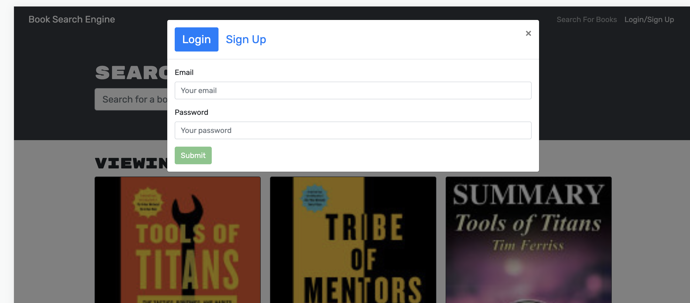

# Challenge 21 : MERN Book Search Engine
   

## Description

Using MERN, a full stack application for a book search engine is created. Users are able to  login/signup, search, and saved books.

Link to Heroku Deployed App: (https://sleepy-reef-74374.herokuapp.com/ )

## Installation
install  
npm, node, express, apollo, mongoose, react, graph ql, jwt, bootstrap, nodemon, concurrently
- npm init 
- npm install
- npm start

## Usage
Users are able to search and save book from Google Books API with the MERN stack application that uses GraphQL built with Apollo Server.

## User Story from MSU Boot Camp
AS AN avid reader
I WANT to search for new books to read
SO THAT I can keep a list of books to purchase

## Acceptance Criteria from MSU Boot Camp
GIVEN a book search engine

WHEN I load the search engine
THEN I am presented with a menu with the options Search for Books and Login/Signup and an input field to search for books and a submit button

WHEN I click on the Search for Books menu option
THEN I am presented with an input field to search for books and a submit button
WHEN I am not logged in and enter a search term in the input field and click the submit button

THEN I am presented with several search results, each featuring a book’s title, author, description, image, and a link to that book on the Google Books site

WHEN I click on the Login/Signup menu option
THEN a modal appears on the screen with a toggle between the option to log in or sign up

WHEN the toggle is set to Signup
THEN I am presented with three inputs for a username, an email address, and a password, and a signup button

WHEN the toggle is set to Login
THEN I am presented with two inputs for an email address and a password and login button

WHEN I enter a valid email address and create a password and click on the signup button
THEN my user account is created and I am logged in to the site

WHEN I enter my account’s email address and password and click on the login button
THEN I the modal closes and I am logged in to the site

WHEN I am logged in to the site
THEN the menu options change to Search for Books, an option to see my saved books, and Logout

WHEN I am logged in and enter a search term in the input field and click the submit button
THEN I am presented with several search results, each featuring a book’s title, author, description, image, and a link to that book on the Google Books site and a button to save a book to my account

WHEN I click on the Save button on a book
THEN that book’s information is saved to my account

WHEN I click on the option to see my saved books
THEN I am presented with all of the books I have saved to my account, each featuring the book’s title, author, description, image, and a link to that book on the Google Books site and a button to remove a book from my account

WHEN I click on the Remove button on a book
THEN that book is deleted from my saved books list

WHEN I click on the Logout button
THEN I am logged out of the site and presented with a menu with the options Search for Books and Login/Signup and an input field to search for books and a submit button  

## Contributions/Licenses/Links

Heroku Deloyed: https://sleepy-reef-74374.herokuapp.com/ 

Github Repo: https://github.com/pppreap/challenge21_mernbooksearch

## Assets
These are images for the working app: Login/Signup, homepage, saved books list, search, and  delete book.

## Licenses

 
This application is covered by the MIT license. 

## Credits
MSU Coding Boot Camp, Google Books API, Heroku

## Tests
None 

## Badges

## Questions
Any question Contact Me : 
Github Username: https://github.com/pppreap  
Contact Email: pppreap@gmail.com

